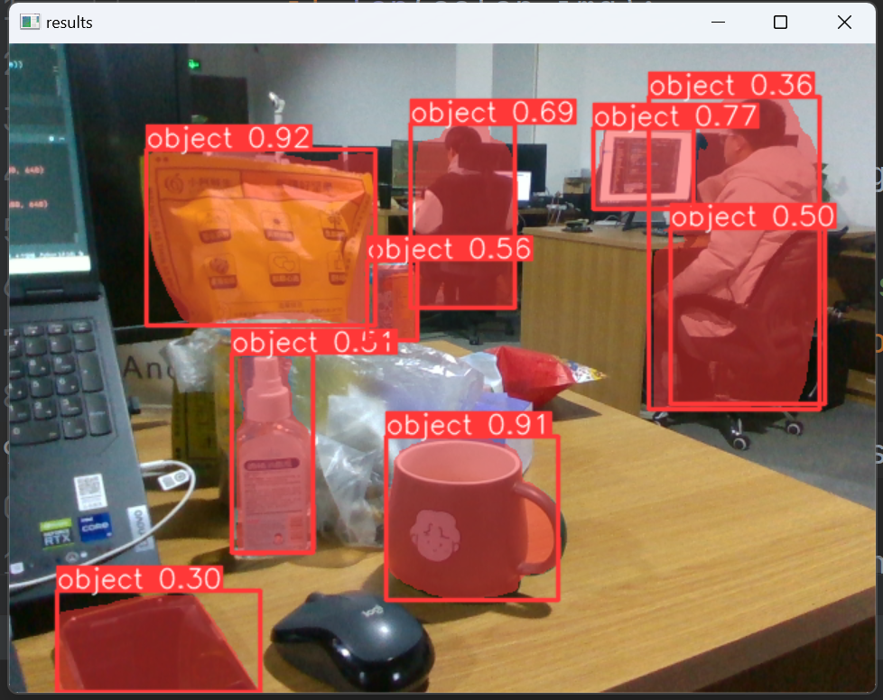
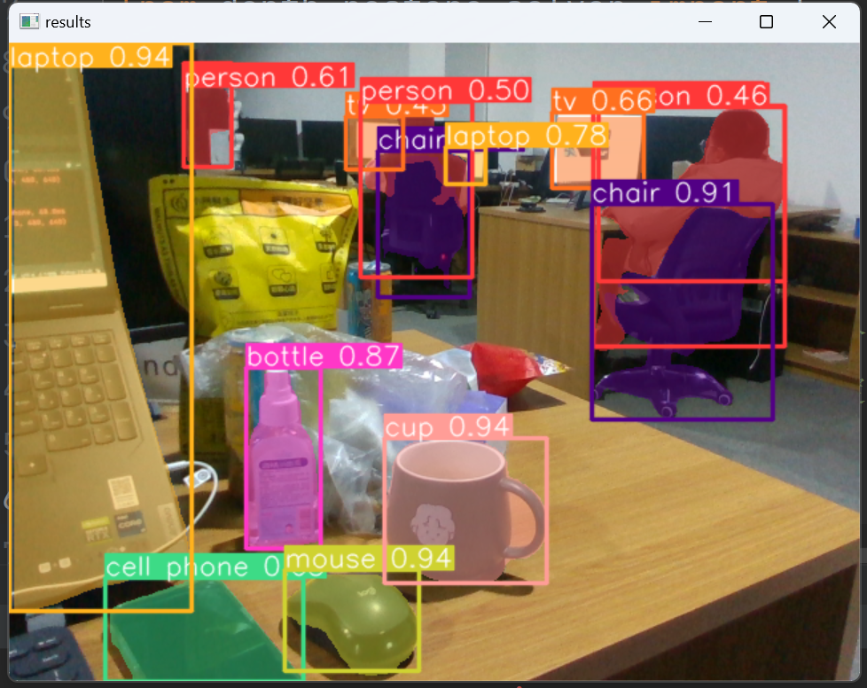

该代码文件为RealMan_AI_Lab分支下ObjectLocator_Classifer（定位器+分类器框架）中的双模态RGBD-YOLO定位器的测试代码。 快速安装参照ObjectLocator_Classifer中的Readme.md。

#### CLI

定位器可以在命令行界面（CLI）中直接使用，只需输入如下命令：

```bash
python predict.py
```
#### Python

定位器可以在 Python 环境中直接使用，并接受与上述 CLI 示例中相同的参数。

RGBD-Yolo定位器在[COCO](https://docs.ultralytics.com/datasets/detect/coco)数据集上预训练的模型权重，以及迁移学习我们自主采集的生活中常见物品的相关模型权重可以通过[我们提供的google drive](https://drive.google.com/file/d/1d1AqtlIJZSzG1Zgph3EEhL1RGZ4G0gZ2/view?usp=drive_link)进行下载并解压至./CD_pth目录下。

</a>
</a>
